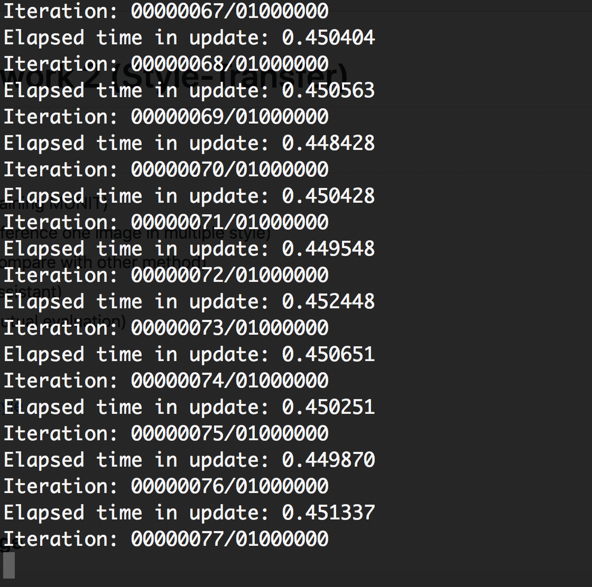
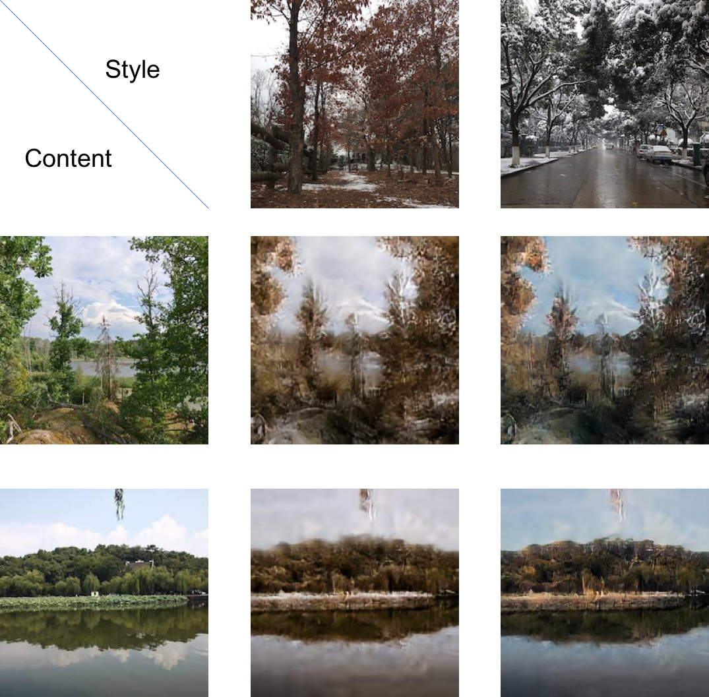
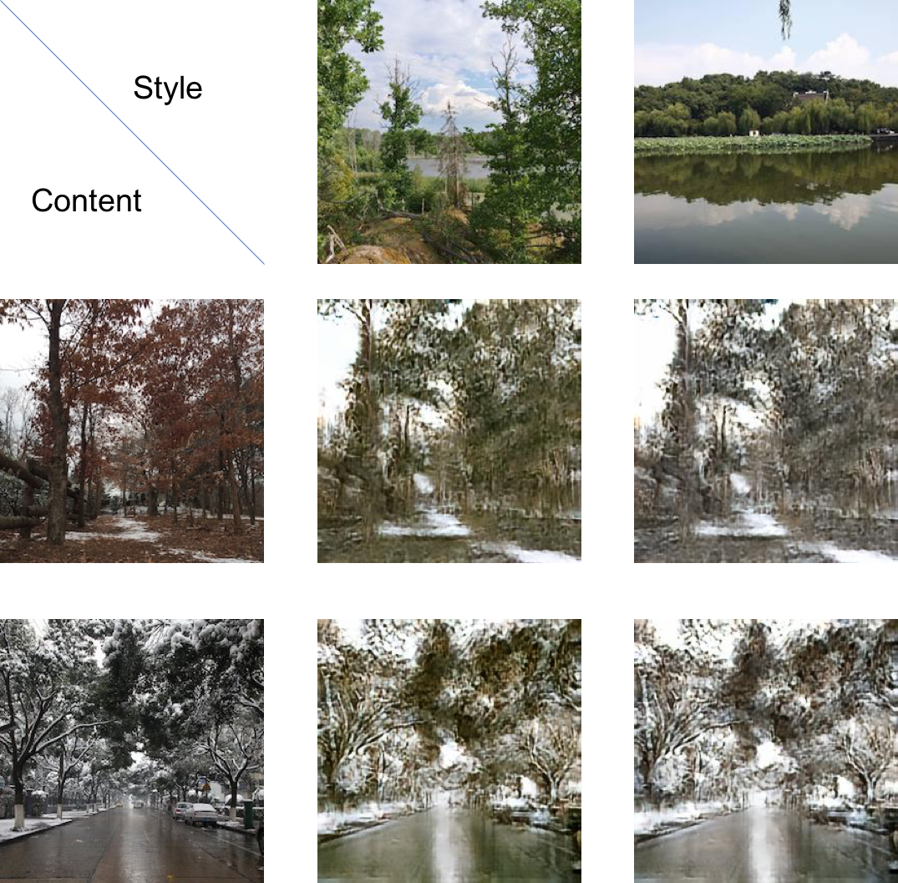
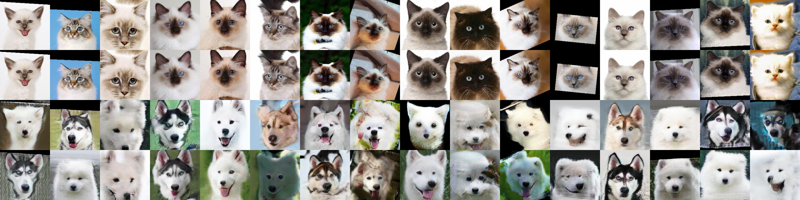
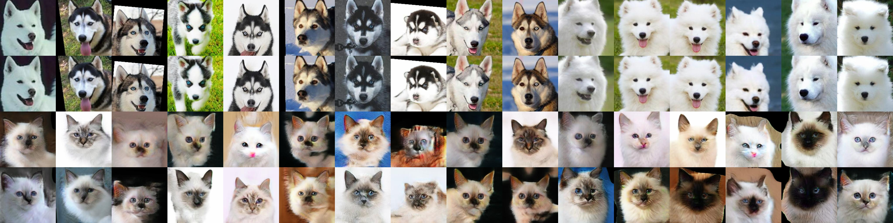
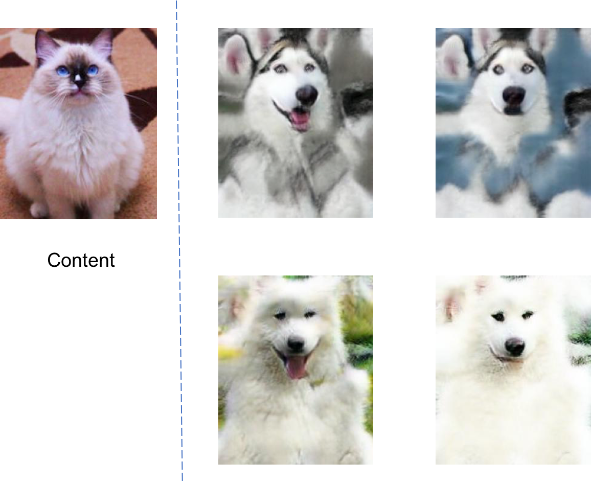
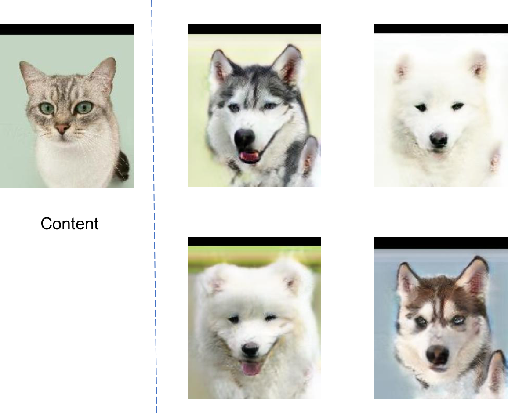
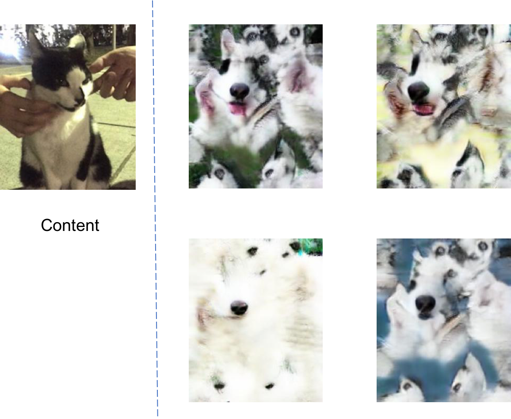
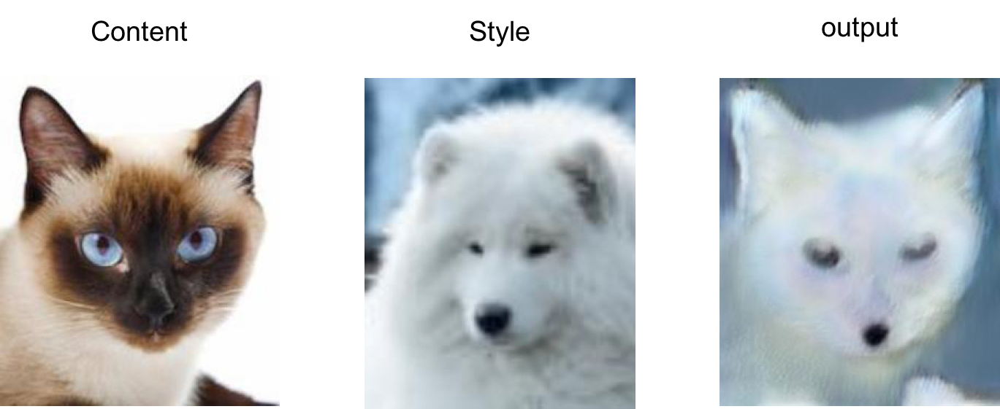

# 2019CVFX_Homework1_Team5

## Training

## Inference Personal Images(MUNIT)
### Summer2Winter 
我們一共 train 了 12 萬個 epoch 結果如下  

 

 
由上面的結果可以看出train到這裡已經很有效果了，summer2winter 這個 dataset 相對於其他 dataset 來說我們覺得更容易得到比較好的結果，因為整體來說只需要學到色系上的變化就可以得到不錯的成果。

### Cat2Dog
接下來我們還 train 了貓跟狗的 dataset,共 train 了 180000 個 epoch,以下為 test 產生出來的結果 

 
以下為我們用自己的圖片去 inference 的結果 

 
可以看出來有成功將貓狗進行轉換，但是效果不如冬天夏天那樣好。我們認為這是因為狗跟貓的外表特徵有蠻大的差異，故在訓練的時候會比夏天冬天來得困難，需要學習更多的特徵，可能要再訓練多一點的 epoch。 
另外我們也發現我們所使用的 dataset 中的貓多為星羅貓，故如果使用其他品種的貓進行轉換，就無法產生正確的效果 

 
由上圖可以看出來，model 僅僅學到了鼻子的部分，可能是因為我們所使用的貓圖片鼻子附近為白色，與 dataset 中的貓相同，而其他部分並未成功的轉換。
 
另外在如果指定 style 去做轉換，效果也不太明顯 

 

## Compare With Other Method

## 結論

