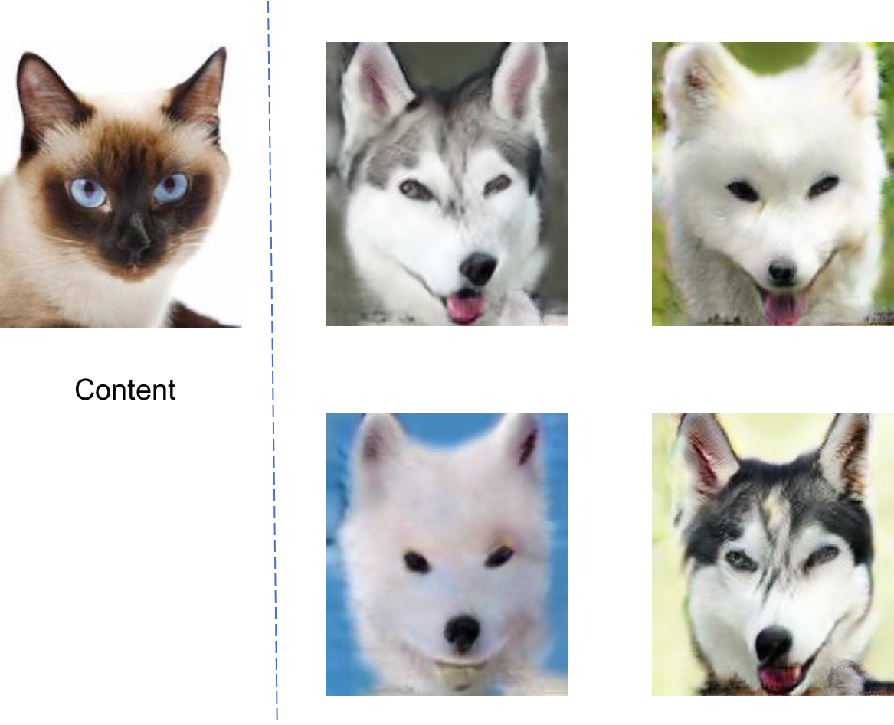

# 2019CVFX_Homework1_Team5

## Training

## Inference Personal Images(MUNIT)
### Summer2Winter 
我們一共 train 了 12 萬個 epoch 結果如下  

 
由上面的結果可以看出train到這裡已經很有效果了，summer2winter 這個 dataset 相對於其他 dataset 來說我們覺得更容易得到比較好的結果，因為整體來說只需要學到色系上的變化就可以得到不錯的成果。

### Cat2Dog
接下來我們還 train 了貓跟狗的 dataset,共 train 了 180000 個 epoch,以下為 test 產生出來的結果 

 
以下為我們用自己的圖片去 inference 的結果 

 
可以看出來有成功將貓狗進行轉換，但是效果不如冬天夏天那樣好。我們認為這是因為狗跟貓的外表特徵有蠻大的差異，故在訓練的時候會比夏天冬天來得困難，需要學習更多的特徵，可能要再訓練多一點的 epoch。 
另外我們也發現我們所使用的 dataset 中的貓多為星羅貓，故如果使用其他品種的貓進行轉換，就無法產生正確的效果 

 
由上圖可以看出來，model 僅僅學到了鼻子的部分，可能是因為我們所使用的貓圖片鼻子附近為白色，與 dataset 中的貓相同，而其他部分並未成功的轉換。
 
另外在如果指定 style 去做轉換，效果也不太明顯 

 

## Compare With Other Method

### UNIT

 
UNIT 希望能夠透過 latent space，讓 model 學會兩種風格的特徵，再藉由這些特徵來生成我們所期望的圖片。
他的架構一共分為：
1. 2 個 Encoder: 學習兩種 style 的特徵
2. latent space: 透過 encoder 後幾層以及 decoder 前幾層的 weight sharing 來學習 latent space
3. 2 個 decoder:學習如何從 latent space 中找出各自的特徵還原出想要的結果
4. discrminator: 用來判定生成結果的好壞

### MUNIT
本次作業的方法即為使用 MUNIT。 
相較於UNIT(Unsupervised Image-to-Image Translation)一對一的圖片輸出，MUNIT的方法則能更進一步針對一張輸入圖片，轉換出多種不同風格的圖片輸出。
在這個方法裡，encoder將不同domain的圖片分別分成content space以及style space。Content space裡包含了不同domain的共同特徵，而style space則是某個domain裡特有的特徵，在進行圖片轉換的過程中，我們保有輸入圖片的content code並合併target domain的隨機的style code來達到多種不同風格圖片的輸出。

### DRIT

 
類似於MUNIT的方法，DRIT也期望透過共享的 content space 加上 domain 特有的attribute space 轉換出多種不同風格的圖片。同時，此方法也加入了 content adversarial loss，為了確保不同 domain 拆解出的 content code不包含自身特定的特徵。
 
DRIT 的架構利用了 4 個 Encoder 來分別學習兩種風格圖像的風格以及特徵。為了如前述所說的讓 content encoder 能夠不包含 attribute，則使兩個 encoder 的最後一個 layer 共享，保證分佈一致，不因 attribute 不同有所差異。並且
在 content space 上加上一個 content discriminator，兩個 encoder 希望可以欺騙 discriminator 讓他分辨不出來是哪一類的向量。

### FastPhoto

## 結論

